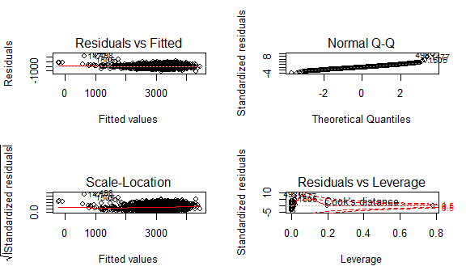

ds\_hw6
================
DITIANLI
November 25, 2018

Problem 1
=========

Create a city\_state variable, and a binary variable indicating whether the homicide is solved. Omit cities Dallas, TX; Phoenix, AZ; and Kansas City, MO, these do not report victim race. Also omit Tulsa, AL this is a data entry mistake. Modifiy victim\_race to have categories white and non-white, with white as the reference category.

``` r
homicide <- 
  read_csv("./data/homicide-data.csv") %>% 
  janitor::clean_names()
```

    ## Parsed with column specification:
    ## cols(
    ##   uid = col_character(),
    ##   reported_date = col_double(),
    ##   victim_last = col_character(),
    ##   victim_first = col_character(),
    ##   victim_race = col_character(),
    ##   victim_age = col_character(),
    ##   victim_sex = col_character(),
    ##   city = col_character(),
    ##   state = col_character(),
    ##   lat = col_double(),
    ##   lon = col_double(),
    ##   disposition = col_character()
    ## )

``` r
homicide 
```

    ## # A tibble: 52,179 x 12
    ##    uid   reported_date victim_last victim_first victim_race victim_age
    ##    <chr>         <dbl> <chr>       <chr>        <chr>       <chr>     
    ##  1 Alb-~      20100504 GARCIA      JUAN         Hispanic    78        
    ##  2 Alb-~      20100216 MONTOYA     CAMERON      Hispanic    17        
    ##  3 Alb-~      20100601 SATTERFIELD VIVIANA      White       15        
    ##  4 Alb-~      20100101 MENDIOLA    CARLOS       Hispanic    32        
    ##  5 Alb-~      20100102 MULA        VIVIAN       White       72        
    ##  6 Alb-~      20100126 BOOK        GERALDINE    White       91        
    ##  7 Alb-~      20100127 MALDONADO   DAVID        Hispanic    52        
    ##  8 Alb-~      20100127 MALDONADO   CONNIE       Hispanic    52        
    ##  9 Alb-~      20100130 MARTIN-LEY~ GUSTAVO      White       56        
    ## 10 Alb-~      20100210 HERRERA     ISRAEL       Hispanic    43        
    ## # ... with 52,169 more rows, and 6 more variables: victim_sex <chr>,
    ## #   city <chr>, state <chr>, lat <dbl>, lon <dbl>, disposition <chr>

``` r
homicide1 <- 
  homicide %>% 
   mutate(victim_race = fct_relevel(ifelse(victim_race == "White", "white", "non-white"), "white"),
         victim_age = ifelse(victim_age == "Unknown", NA, as.integer(victim_age)),
         victim_sex = as.factor(victim_sex),
         city_state = paste(paste0(city, ","), state),
         resolved = as.numeric(disposition == "Closed by arrest")) %>% 
  filter(!city_state %in% c("Dallas, TX", "Phoenix, AZ", "Kansas City, MO", "Tulsa, AL")) %>% 
  select(uid, victim_race, victim_age, victim_sex, city_state, resolved)
```

    ## Warning in ifelse(victim_age == "Unknown", NA, as.integer(victim_age)): NAs
    ## introduced by coercion

``` r
homicide1
```

    ## # A tibble: 48,507 x 6
    ##    uid        victim_race victim_age victim_sex city_state      resolved
    ##    <chr>      <fct>            <int> <fct>      <chr>              <dbl>
    ##  1 Alb-000001 non-white           78 Male       Albuquerque, NM        0
    ##  2 Alb-000002 non-white           17 Male       Albuquerque, NM        1
    ##  3 Alb-000003 white               15 Female     Albuquerque, NM        0
    ##  4 Alb-000004 non-white           32 Male       Albuquerque, NM        1
    ##  5 Alb-000005 white               72 Female     Albuquerque, NM        0
    ##  6 Alb-000006 white               91 Female     Albuquerque, NM        0
    ##  7 Alb-000007 non-white           52 Male       Albuquerque, NM        1
    ##  8 Alb-000008 non-white           52 Female     Albuquerque, NM        1
    ##  9 Alb-000009 white               56 Male       Albuquerque, NM        0
    ## 10 Alb-000010 non-white           43 Male       Albuquerque, NM        0
    ## # ... with 48,497 more rows

For the city of Baltimore, MD, use the glm function to fit a logistic regression with resolved vs unresolved as the outcome and victim age, sex and race (as just defined) as predictors.

``` r
balt <- homicide1 %>% 
  filter(city_state == "Baltimore, MD")

fit <- glm(resolved ~ victim_age + victim_sex + victim_race, data = balt, family = binomial()) %>% 
  broom::tidy()
fit
```

    ## # A tibble: 4 x 5
    ##   term                 estimate std.error statistic  p.value
    ##   <chr>                   <dbl>     <dbl>     <dbl>    <dbl>
    ## 1 (Intercept)           1.19      0.235        5.06 4.30e- 7
    ## 2 victim_age           -0.00699   0.00326     -2.14 3.22e- 2
    ## 3 victim_sexMale       -0.888     0.136       -6.53 6.80e-11
    ## 4 victim_racenon-white -0.820     0.175       -4.69 2.68e- 6

``` r
save(fit,file = "fit_glm.RData") #Save the output of glm as an R object
```

Obtain the estimate and confidence interval of the adjusted odds ratio for solving homicides comparing non-white victims to white victims keeping all other variables fixed.

``` r
fit <- fit %>% 
  mutate(OR = exp(estimate),
         CI_low = exp(estimate - std.error*1.96),
         CI_up = exp(estimate + std.error*1.96)) %>% 
  dplyr::select(term, estimate, OR, CI_low, CI_up) %>% 
    knitr::kable(digits = 2)
fit
```

| term                  |  estimate|    OR|  CI\_low|  CI\_up|
|:----------------------|---------:|-----:|--------:|-------:|
| (Intercept)           |      1.19|  3.27|     2.07|    5.19|
| victim\_age           |     -0.01|  0.99|     0.99|    1.00|
| victim\_sexMale       |     -0.89|  0.41|     0.32|    0.54|
| victim\_racenon-white |     -0.82|  0.44|     0.31|    0.62|

Comment:The estimate OR for race is 0.44(95%CI:0.31,0.62). Interpretation: the odds of resolving the case for non-white people is 0.441 times the odds compared to white people.

Run glm for each of the cities in your dataset, and extract the adjusted odds ratio (and CI) for solving homicides comparing non-white victims to white victims.

``` r
city_logistic = function(x){
  
    homicide1 %>% 
    filter(city_state == x) %>% 
    glm(resolved ~ victim_age + victim_sex + victim_race, data = ., family = binomial())  %>% 
    broom::tidy() %>% 
    mutate(OR = exp(estimate),
           CI_low = exp(estimate - 1.96 * std.error),
           CI_up = exp(estimate + 1.96 * std.error)) %>% 
    filter(term == "victim_racenon-white") %>% 
    select(beta = estimate, p.value, OR, CI_low,CI_up)
}

city_result = 
  tibble(city_state = unique(homicide1$city_state)) %>% 
  mutate(map(.x = unique(homicide1$city_state), ~city_logistic(.x))) %>% 
  unnest
```

Create a plot that shows the estimated ORs and CIs for each city.

``` r
city_result %>% 
  ggplot(aes(x = reorder(city_state, OR), y = OR)) +
    geom_point() +
    geom_errorbar(aes(ymin = CI_low, ymax = CI_up)) +
    theme(axis.text.x = element_text(angle = 90, vjust = 0.3, size = 8)) +
    labs(
      x = "City",
      y = "OR",
      title = "Estimated OR for Solving Homicides Comparing Non-white Victims to White Victims"
    )
```


Comment: The OR differs from state to state, but the mean odds ratio of solving for a non-white victim case compared to white victime is less than 1, which means non-white victim cases are more likely to be unsolved. Boston has the smallest OR, Tampa has the largest OR, Durham has the largest CI.

Problem 2
=========

In this probelm, we analyzed data gathered to understand the effects of several variables on a child’s birthweight.

``` r
birthweight<- read_csv("./data/birthweight.csv") 
```

    ## Parsed with column specification:
    ## cols(
    ##   .default = col_double()
    ## )

    ## See spec(...) for full column specifications.

``` r
birthweight%>% 
  janitor::clean_names() %>% 
  na.omit() %>% 
  mutate(babysex = as.factor(babysex),
         frace = as.factor(frace),
         malform = as.factor(malform),
         mrace = as.factor(mrace))
```

    ## # A tibble: 4,342 x 20
    ##    babysex bhead blength   bwt delwt fincome frace gaweeks malform menarche
    ##    <fct>   <dbl>   <dbl> <dbl> <dbl>   <dbl> <fct>   <dbl> <fct>      <dbl>
    ##  1 2          34      51  3629   177      35 1        39.9 0             13
    ##  2 1          34      48  3062   156      65 2        25.9 0             14
    ##  3 2          36      50  3345   148      85 1        39.9 0             12
    ##  4 1          34      52  3062   157      55 1        40   0             14
    ##  5 2          34      52  3374   156       5 1        41.6 0             13
    ##  6 1          33      52  3374   129      55 1        40.7 0             12
    ##  7 2          33      46  2523   126      96 2        40.3 0             14
    ##  8 2          33      49  2778   140       5 1        37.4 0             12
    ##  9 1          36      52  3515   146      85 1        40.3 0             11
    ## 10 1          33      50  3459   169      75 2        40.7 0             12
    ## # ... with 4,332 more rows, and 10 more variables: mheight <dbl>,
    ## #   momage <dbl>, mrace <fct>, parity <dbl>, pnumlbw <dbl>, pnumsga <dbl>,
    ## #   ppbmi <dbl>, ppwt <dbl>, smoken <dbl>, wtgain <dbl>

``` r
library(psych)
```

    ## 
    ## Attaching package: 'psych'

    ## The following object is masked from 'package:modelr':
    ## 
    ##     heights

    ## The following objects are masked from 'package:ggplot2':
    ## 
    ##     %+%, alpha

``` r
describe(birthweight)
```

    ##          vars    n    mean     sd  median trimmed    mad    min    max
    ## babysex     1 4342    1.49   0.50    1.00    1.48   0.00   1.00    2.0
    ## bhead       2 4342   33.65   1.62   34.00   33.72   1.48  21.00   41.0
    ## blength     3 4342   49.75   2.72   50.00   49.88   2.97  20.00   63.0
    ## bwt         4 4342 3114.40 512.15 3132.50 3130.76 482.59 595.00 4791.0
    ## delwt       5 4342  145.57  22.21  143.00  143.84  19.27  86.00  334.0
    ## fincome     6 4342   44.11  25.98   35.00   42.02  29.65   0.00   96.0
    ## frace       7 4342    1.66   0.85    2.00    1.51   1.48   1.00    8.0
    ## gaweeks     8 4342   39.43   3.15   39.90   39.69   2.08  17.70   51.3
    ## malform     9 4342    0.00   0.06    0.00    0.00   0.00   0.00    1.0
    ## menarche   10 4342   12.51   1.48   12.00   12.47   1.48   0.00   19.0
    ## mheight    11 4342   63.49   2.66   63.00   63.51   2.97  48.00   77.0
    ## momage     12 4342   20.30   3.88   20.00   19.94   2.97  12.00   44.0
    ## mrace      13 4342    1.63   0.77    2.00    1.51   1.48   1.00    4.0
    ## parity     14 4342    0.00   0.10    0.00    0.00   0.00   0.00    6.0
    ## pnumlbw    15 4342    0.00   0.00    0.00    0.00   0.00   0.00    0.0
    ## pnumsga    16 4342    0.00   0.00    0.00    0.00   0.00   0.00    0.0
    ## ppbmi      17 4342   21.57   3.18   21.03   21.22   2.40  13.07   46.1
    ## ppwt       18 4342  123.49  20.16  120.00  121.65  14.83  70.00  287.0
    ## smoken     19 4342    4.15   7.41    0.00    2.36   0.00   0.00   60.0
    ## wtgain     20 4342   22.08  10.94   22.00   21.73   8.90 -46.00   89.0
    ##            range  skew kurtosis   se
    ## babysex     1.00  0.05    -2.00 0.01
    ## bhead      20.00 -1.01     4.45 0.02
    ## blength    43.00 -1.17     7.04 0.04
    ## bwt      4196.00 -0.49     1.35 7.77
    ## delwt     248.00  1.20     3.72 0.34
    ## fincome    96.00  0.61    -0.64 0.39
    ## frace       7.00  2.37    10.46 0.01
    ## gaweeks    33.60 -1.44     5.92 0.05
    ## malform     1.00 16.92   284.34 0.00
    ## menarche   19.00  0.12     1.58 0.02
    ## mheight    29.00 -0.19     1.12 0.04
    ## momage     32.00  1.30     3.43 0.06
    ## mrace       3.00  1.49     2.45 0.01
    ## parity      6.00 51.49  2821.55 0.00
    ## pnumlbw     0.00   NaN      NaN 0.00
    ## pnumsga     0.00   NaN      NaN 0.00
    ## ppbmi      33.03  1.59     4.96 0.05
    ## ppwt      217.00  1.49     5.18 0.31
    ## smoken     60.00  2.22     5.38 0.11
    ## wtgain    135.00  0.43     2.74 0.17

Use psych package to check distributions, pnumlbw and pnumsga are all zero, and other variables do not have missing data.

``` r
fit_full = lm(bwt ~ .,data = birthweight)
step(fit_full, direction="backward",trace = 0)
```

    ## 
    ## Call:
    ## lm(formula = bwt ~ babysex + bhead + blength + delwt + fincome + 
    ##     gaweeks + menarche + mheight + momage + mrace + parity + 
    ##     ppwt + smoken, data = birthweight)
    ## 
    ## Coefficients:
    ## (Intercept)      babysex        bhead      blength        delwt  
    ##  -6246.3672      32.3171     134.4298      76.3760       3.9564  
    ##     fincome      gaweeks     menarche      mheight       momage  
    ##      0.6597      12.0396      -4.3140       5.4408       3.4549  
    ##       mrace       parity         ppwt       smoken  
    ##    -53.4990      89.9677      -2.8323      -3.7116

Using backward method to select model.

``` r
my_model = lm(bwt ~ babysex + bhead + blength + gaweeks + mheight + mrace + parity + smoken,data = birthweight)
summary(my_model)
```

    ## 
    ## Call:
    ## lm(formula = bwt ~ babysex + bhead + blength + gaweeks + mheight + 
    ##     mrace + parity + smoken, data = birthweight)
    ## 
    ## Residuals:
    ##      Min       1Q   Median       3Q      Max 
    ## -1140.10  -182.86    -7.71   176.43  2456.43 
    ## 
    ## Coefficients:
    ##               Estimate Std. Error t value Pr(>|t|)    
    ## (Intercept) -6547.8991   138.8358 -47.163  < 2e-16 ***
    ## babysex        31.6579     8.6716   3.651 0.000265 ***
    ## bhead         138.9951     3.4950  39.770  < 2e-16 ***
    ## blength        78.3526     2.0568  38.094  < 2e-16 ***
    ## gaweeks        13.5647     1.4940   9.079  < 2e-16 ***
    ## mheight         9.7399     1.6595   5.869 4.71e-09 ***
    ## mrace         -61.3746     5.8473 -10.496  < 2e-16 ***
    ## parity        102.1132    41.4022   2.466 0.013688 *  
    ## smoken         -3.3094     0.5889  -5.619 2.04e-08 ***
    ## ---
    ## Signif. codes:  0 '***' 0.001 '**' 0.01 '*' 0.05 '.' 0.1 ' ' 1
    ## 
    ## Residual standard error: 279.7 on 4333 degrees of freedom
    ## Multiple R-squared:  0.7024, Adjusted R-squared:  0.7018 
    ## F-statistic:  1278 on 8 and 4333 DF,  p-value: < 2.2e-16

``` r
par(mfrow = c(2,2))#check assumption
plot(my_model)
```



According to article'European Journal of Obstetrics & Gynecology and Reproductive Biology' and 'Maternal pregravid weight, age, and smoking status as risk factors for low birth weight births' and from the result of backward selection, we finally decide to choose babysex, bhead, blength, gaweeks, mheight, mrace, parity and smoken as predictors in our final model. Q-Q plot is roughly linear, the assumption is not violated.

``` r
birthweight %>% 
  add_residuals(my_model) %>% 
  add_predictions(my_model) %>% 
  ggplot(aes(x = pred, y = resid)) + 
  geom_point(alpha = 0.3) +
  labs(
     title = "Model residuals against fitted values",
     x = "Fitted values",
     y = "Residuals"
   )
```


Comment: the residuals are clusteredd, we need to revise the model.

``` r
model1 <- lm(bwt ~ blength + gaweeks, data = birthweight)
summary(model1)
```

    ## 
    ## Call:
    ## lm(formula = bwt ~ blength + gaweeks, data = birthweight)
    ## 
    ## Residuals:
    ##     Min      1Q  Median      3Q     Max 
    ## -1709.6  -215.4   -11.4   208.2  4188.8 
    ## 
    ## Coefficients:
    ##              Estimate Std. Error t value Pr(>|t|)    
    ## (Intercept) -4347.667     97.958  -44.38   <2e-16 ***
    ## blength       128.556      1.990   64.60   <2e-16 ***
    ## gaweeks        27.047      1.718   15.74   <2e-16 ***
    ## ---
    ## Signif. codes:  0 '***' 0.001 '**' 0.01 '*' 0.05 '.' 0.1 ' ' 1
    ## 
    ## Residual standard error: 333.2 on 4339 degrees of freedom
    ## Multiple R-squared:  0.5769, Adjusted R-squared:  0.5767 
    ## F-statistic:  2958 on 2 and 4339 DF,  p-value: < 2.2e-16

``` r
model2<- lm(bwt ~ bhead + blength + babysex + bhead*babysex + bhead*blength + blength*babysex + bhead*babysex*blength, data = birthweight)
summary(model2)
```

    ## 
    ## Call:
    ## lm(formula = bwt ~ bhead + blength + babysex + bhead * babysex + 
    ##     bhead * blength + blength * babysex + bhead * babysex * blength, 
    ##     data = birthweight)
    ## 
    ## Residuals:
    ##      Min       1Q   Median       3Q      Max 
    ## -1132.99  -190.42   -10.33   178.63  2617.96 
    ## 
    ## Coefficients:
    ##                         Estimate Std. Error t value Pr(>|t|)    
    ## (Intercept)           -13551.685   2759.413  -4.911 9.39e-07 ***
    ## bhead                    380.189     83.395   4.559 5.28e-06 ***
    ## blength                  225.900     57.398   3.936 8.43e-05 ***
    ## babysex                 6374.868   1677.767   3.800 0.000147 ***
    ## bhead:babysex           -198.393     51.092  -3.883 0.000105 ***
    ## bhead:blength             -4.432      1.715  -2.583 0.009815 ** 
    ## blength:babysex         -123.773     35.119  -3.524 0.000429 ***
    ## bhead:blength:babysex      3.878      1.057   3.670 0.000245 ***
    ## ---
    ## Signif. codes:  0 '***' 0.001 '**' 0.01 '*' 0.05 '.' 0.1 ' ' 1
    ## 
    ## Residual standard error: 287.7 on 4334 degrees of freedom
    ## Multiple R-squared:  0.6849, Adjusted R-squared:  0.6844 
    ## F-statistic:  1346 on 7 and 4334 DF,  p-value: < 2.2e-16

``` r
cv <- birthweight %>% 
  crossv_mc(100)

cv_compare<-cv %>% 
   mutate(
     my_model = map(train, ~lm(bwt ~ babysex + bhead + blength + gaweeks + mheight + mrace + parity + smoken,data = .)), 
     model1 = map(train, ~lm(bwt ~ blength + gaweeks, data = .)),
     model2 = map(train, ~lm(bwt ~ bhead + blength + babysex + bhead*babysex + bhead*blength + blength*babysex + bhead*babysex*blength, data = .)))%>% 
   mutate(rmse_my_model = map2_dbl(my_model, test, ~rmse(.x, .y)),
         rmse_model1 = map2_dbl(model1, test, ~rmse(.x, .y)),
         rmse_model2 = map2_dbl(model2, test, ~rmse(.x, .y)))
```

    ## Warning in predict.lm(model, data): prediction from a rank-deficient fit
    ## may be misleading

    ## Warning in predict.lm(model, data): prediction from a rank-deficient fit
    ## may be misleading

``` r
cv_compare %>% 
  dplyr::select(starts_with('rmse')) %>% 
  gather(key = model, value = rmse, rmse_my_model:rmse_model2) %>%  
  mutate(model = str_replace(model, "rmse_", "")) %>% 
  ggplot(aes(x = model, y = rmse)) +
  geom_violin() + 
  labs(
     title = "Prediction error distribution for models",
     x = "Model",
     y = "RMSE"
   )
```

 Comment: Based on the RMSE, the my\_model have the least mean rmse and least error variance across these three models. The first model with only parameters in linear form has the least predictive ability. The second model involving main effect of baby head circumference, body length, babysex and their interactions have better predictive capability than the first one.
